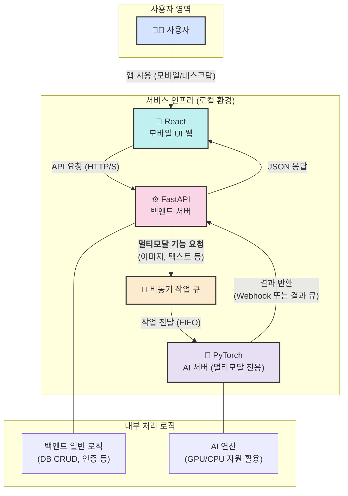

# 이미지 기반 반려동물 위해 식품 식별 및 분석 - PET Poison Guard

## Introduction

- Pet Poison Guard는 반려동물의 안전을 위해 설계된 애플리케이션입니다.
- 이 애플리케이션은 이미지를 기반으로 반려동물에게 위험이 될 수 있는 유해 식품을 감지하고 사용자가 반려동물의 건강을 지킬 수 있도록 돕습니다.

## 기능

- **유해 물질 데이터베이스**: 반려동물에게 위험한 물질에 대한 정보를 제공합니다.
- **이미지 기반 위해 식품 식별 및 분석**: 음식 이미지를 기반으로 반려동물에게 위험한 식품인지 식별하고, 왜 위험한지 분석합니다.




## 설치 방법

1. 이 저장소를 클론합니다.
   ```bash
   git clone https://github.com/ShinYoung-hwan/pet-poison-guard.git
   ```
2. 필요한 패키지를 설치합니다.
   ```bash
   cd pet-poison-guard/backend
   pip install -r requirements.txt
   ```
3. 데이터베이스를 설정합니다.
   ```bash
   # 데이터베이스 초기화 명령어
   ```

## 사용 방법

1. 서버를 실행합니다.
   ```bash
   uvicorn main:app --reload
   ```
2. 웹 브라우저에서 `http://localhost:8000`에 접속합니다.

## 기여 방법

기여를 원하시는 분은 이슈를 생성하거나 Pull Request를 제출해 주세요.

## 기술 스택

- **프론트엔드**: React
- **백엔드**: FastAPI
- **데이터베이스**: SQLAlchemy

## 라이센스

## 연락처

- 이메일: shinefilm1@gmail.com
- GitHub: [Young-Hwan Shin](https://github.com/ShinYoung-hwan)
