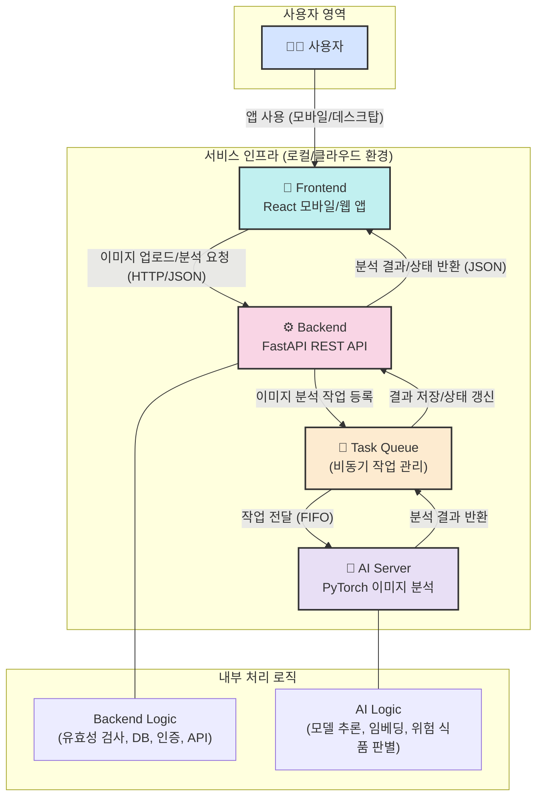

# **Pet Poison Guard** - 반려동물의 안전을 위한 이미지 기반 유해 식품 분석 서비스

## 목차 (Table of Contents) 📜

- [프로젝트 소개](#3-프로젝트-소개-project-description-🚀)
- [주요 기능](#4-주요-기능-key-features-✨)
- [설치 방법](#5-설치-방법-installation-guide-⚙️)
- [사용 방법](#6-사용-방법-how-to-use-🛠️)
- [지원 및 문의](#7-지원-및-문의-support-and-contact-🤝)
- [기여 방법](#기여-방법)
- [기술 스택](#기술-스택)
- [라이센스](#라이센스)


## 1. 프로젝트 소개 (Project Description) 🚀

Pet Poison Guard는 반려동물에게 위험할 수 있는 음식 이미지를 업로드하면 AI가 분석하여 위험 식품 여부와 상세 정보를 제공합니다.  
사용자는 복잡한 검색 없이 이미지만 업로드하면, 반려동물의 건강을 지키는 데 필요한 정보를 빠르게 확인할 수 있습니다.

<!-- TODO: Insert Live Service URL  -->

## 2. 주요 기능 (Key Features) ✨

- 🐶 **유해 물질 데이터베이스:** 반려동물에게 위험한 식품 정보를 제공합니다.
- 🖼️ **이미지 기반 분석:** 음식 이미지를 업로드하면 AI가 위험 식품 여부를 판별합니다.
- 📊 **분석 결과 및 설명:** 위험 식품일 경우, 상세 설명과 위험도 정보를 제공합니다.
- 📱 **모바일 친화적 UI:** 반응형 디자인으로 모든 기기에서 사용 가능.
- ♿ **접근성 고려:** 누구나 쉽게 사용할 수 있도록 UI 설계.
- 🔗 **RESTful API:** 프론트엔드와 백엔드가 효율적으로 통신합니다.

-----

## 3. 설치 방법 (Installation Guide) ⚙️

### 1. 저장소 클론
```sh
git clone https://github.com/ShinYoung-hwan/pet-poison-guard.git
```

### 2. 백엔드 패키지 설치
```sh
cd pet-poison-guard/ppg_backend
pip install -r requirements.txt
```

### 3. 프론트엔드 패키지 설치
```sh
cd ../ppg_frontend
npm install
```

### 4. 데이터베이스 및 모델 파일 준비
<!-- TODO: Refactor to use DBMS! -->
- AI 모델 및 데이터 파일은 `ppg_backend/app/services/snapshots/`에 위치해야 합니다.
- 필요시 데이터베이스 초기화 명령어를 실행하세요.

-----
## 4. 사용 방법 (How to Use) 🛠️

### 1. 서버 실행
```sh
# 백엔드 실행
cd ppg_backend
source .venv/bin/activate
uvicorn main:app --reload

# 프론트엔드 실행
cd ../ppg_frontend
npm run dev
```

### 2. 웹 브라우저 접속
<!-- TODO: UPDATE URL! -->
- 프론트엔드: [http://localhost:5173](http://localhost:5173)
- 백엔드 API: [http://localhost:8000](http://localhost:8000)

### 3. 이미지 업로드 및 분석
1. 웹에서 '이미지 업로드' 버튼 클릭
2. 분석 결과 및 위험 식품 정보 확인

-----

## 7. 지원 및 문의 (Support and Contact) 🤝

- **이메일:** shinefilm1@gmail.com
- **GitHub Issue:** [프로젝트 이슈 페이지](https://github.com/ShinYoung-hwan/pet-poison-guard/issues)
- **공식 홈페이지:** 준비 중

-----

## 기여 방법

- 이슈를 생성하거나 Pull Request를 제출해 주세요.
- 커밋 메시지는 기능/버그/문서 등 목적에 따라 명확하게 작성합니다.

## 기술 스택

- **프론트엔드:** React, TypeScript, Vite, Material-UI
- **백엔드:** FastAPI, Python, Pydantic
- **AI 서버:** PyTorch 기반 이미지 분석 모델
- **데이터베이스:** (추후 확장 가능)

<!-- 
TODO: Update License
## 라이센스

- 
 -->

-----

<!-- 프로젝트 구조 및 데이터 흐름 다이어그램 -->
