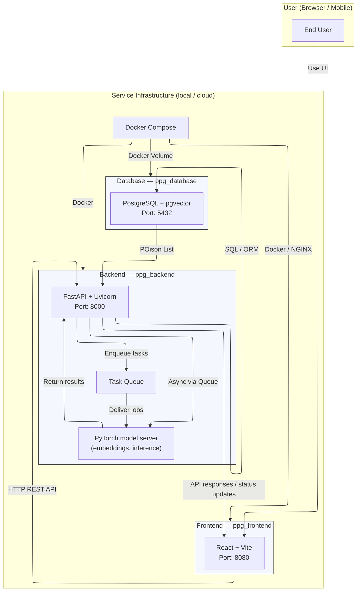

# **Pet Poison Guard** - 반려동물의 안전을 위한 이미지 기반 유해 식품 분석 서비스

## 목차 (Table of Contents) 📜

- [프로젝트 소개](#1-프로젝트-소개-project-description-🚀)
- [주요 기능](#2-주요-기능-key-features-✨)
- [설치 방법](#3-설치-방법-installation-guide-⚙️)
- [사용 방법](#4-사용-방법-how-to-use-🛠️)
- [지원 및 문의](#5-지원-및-문의-support-and-contact-🤝)
- [기여 방법](#기여-방법)
- [기술 스택](#기술-스택)

Live web service: [http://20.41.123.39/] (서비스는 졸업평가가 마무리될 때까지 실행됩니다)

## 1. 프로젝트 소개 (Project Description) 🚀

Pet Poison Guard는 반려동물에게 위험할 수 있는 음식 이미지를 업로드하면 AI가 분석하여 위험 식품 여부와 상세 정보를 제공합니다.  
사용자는 복잡한 검색 없이 이미지만 업로드하면, 반려동물의 건강을 지키는 데 필요한 정보를 빠르게 확인할 수 있습니다.

<!-- TODO: Insert Live Service URL  -->

## 2. 주요 기능 (Key Features) ✨

- 🐶 **유해 물질 데이터베이스:** 반려동물에게 위험한 식품 정보를 제공합니다.
- 🖼️ **이미지 기반 분석:** 음식 이미지를 업로드하면 AI가 위험 식품 여부를 판별합니다.
- 📊 **분석 결과 및 설명:** 위험 식품일 경우, 상세 설명과 위험도 정보를 제공합니다.
- 📱 **모바일 친화적 UI:** 반응형 디자인으로 모든 기기에서 사용 가능.
- ♿ **접근성 고려:** 누구나 쉽게 사용할 수 있도록 UI 설계.
- 🔗 **RESTful API:** 프론트엔드와 백엔드가 효율적으로 통신합니다.

-----

## 3. 설치 방법 (Installation Guide) ⚙️

### 0. Git LFS 다운로드
```sh
sudo apt install git-lfs
```

### 1. 저장소 클론
```sh
git clone https://github.com/ShinYoung-hwan/pet-poison-guard.git
```

### 2. AI 모델 파일 및 데이터베이스 파일 준비
* AI 모델 파일
  - [im2recipe-Pytorch](https://github.com/torralba-lab/im2recipe-Pytorch)에서 pretrained 모델을 다운로드 받습니다.
  - AI 모델은 [`ppg_backend/app/services/snapshots/`](ppg_backend/app/services/snapshots/)에 위치해야 합니다. 
  - [`ppg_backend/app/services/snapshots/config.json`](ppg_backend/app/services/snapshots/config.json) 파일의 `model_path`를 업데이트해줍니다.

* 데이터베이스 파일
  - layer1.json
  - rec_ids.pkl, rec_embeds.pkl
  - petpoison_data.json
  - [Recipe1M+](https://forms.gle/EzYSu8j3D1LJzVbR8)에서 데이터셋 접근 신청을 한 후 layer1.json을 다운로드 받는다.
  - rec_ids.pkl, rec_embeds.pkl, petpoison_data.json은 git-lfs로 관리되고 있다. (pkl 파일들은 [`im2recipe-Pytorch`](https://github.com/torralba-lab/im2recipe-Pytorch?tab=readme-ov-file#pretrained-model)의 test.py를 실행시켜 생성할 수 있다.)

  - DB 데이터 파일은 [`ppg_database/data`](ppg_database/data) 디렉토리에 위치시킨다.

### 3. Docker Compose

```sh
docker compose up -d
```
- 최초 실행 시 데이터 적재 시간이 필요합니다.
- 컨테이너 로그로 진행 상황을 확인할 수 있습니다:
```sh
docker logs ppg_database
```

-----
## 4. 사용 방법 (How to Use) 🛠️

### 1. 서버 실행
```sh
docker compose up
```

### 2. 웹 브라우저 접속
- 프론트엔드: [http://localhost:8080](http://localhost:8080)
- 백엔드 API: [http://localhost:8000/docs](http://localhost:8000/docs)

### 3. 이미지 업로드 및 분석
1. 웹에서 '이미지 업로드' 버튼 클릭
2. 분석 결과 및 위험 식품 정보 확인

-----

## 7. 지원 및 문의 (Support and Contact) 🤝

- **이메일:** shinefilm1@gmail.com
- **GitHub Issue:** [프로젝트 이슈 페이지](https://github.com/ShinYoung-hwan/pet-poison-guard/issues)

-----

## 기여 방법

- 이슈를 생성하거나 Pull Request를 제출해 주세요.
- 커밋 메시지는 기능/버그/문서 등 목적에 따라 명확하게 작성합니다.

## 기술 스택

- **프론트엔드:** React, TypeScript, Vite, Material-UI
- **백엔드:** FastAPI, Python, Pydantic
- **AI 서버:** PyTorch 기반 이미지 분석 모델
- **데이터베이스:** PostgreSQL 17 + pgvector

-----

<!-- 프로젝트 구조 및 데이터 흐름 다이어그램 -->
